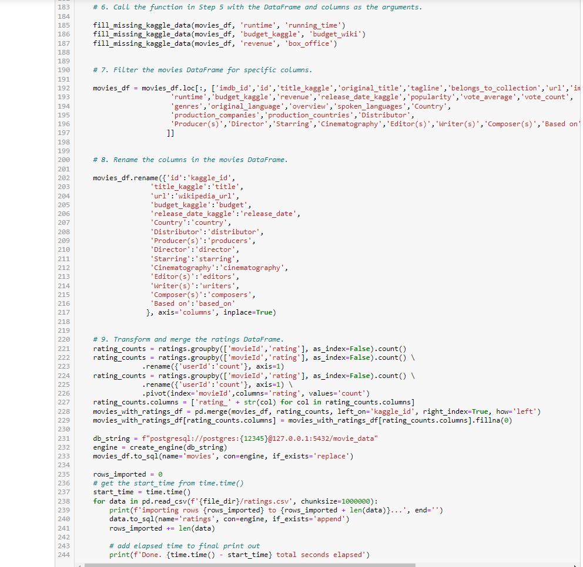

## **Movies-ETL**

### Amazing Prime which is a platform for and streaming movies and tv shows only.  My task for Amazing Prime was to create an algorithm to determine which low budget movies will become popular so that they can buy the streaming rights of that movie at a bargain.  

### Amazing prime loved the dataset and wants to keep it updated on a daily basis. I now need tp to create an automated pipeline that takes in new data, performs the appropriate transformations, and loads the data into existing tables. You’ll need to refactor the code from this module to create one function that takes in the three files—Wikipedia data, Kaggle metadata, and the MovieLens rating data—and performs the ETL process by adding the data to a PostgreSQL database.

### First, I needed to Create an ETL pipeline from raw data to a SQL database.
### Next, I Extracted data from three sources using Python.
### Then, I cleaned and transformed data using Pandas.
### After that, I use regular expressions to parse data and to transform text into numbers.
### Finally, I loaded data with PostgreSQL.

Deliverable 1: Write an ETL Function to Read Three Data Files

Deliverable 2: Extract and Transform the Wikipedia Data

Deliverable 3: Extract and Transform the Kaggle data

Deliverable 4: Create the Movie Database

